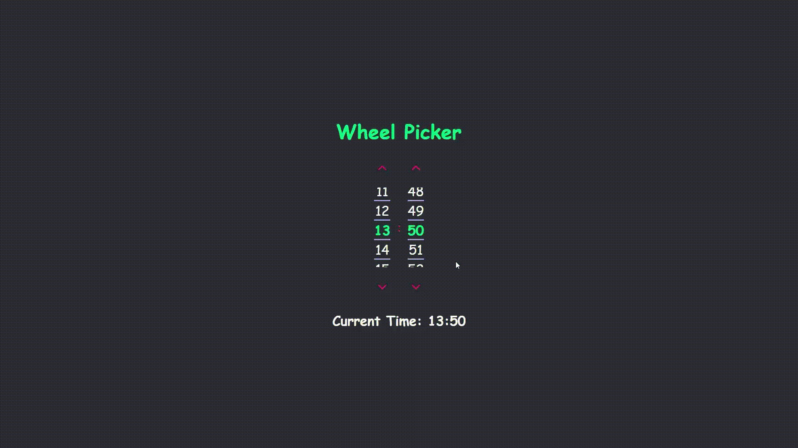
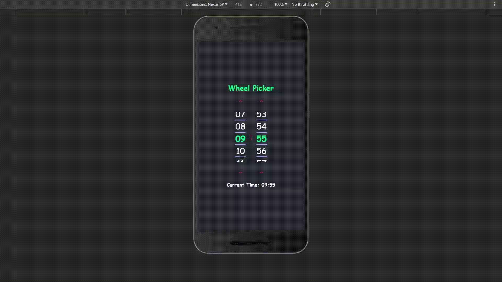

# Wheel Picker

A customizable wheel picker component built with React. Enhance your forms and UI interactions with a visually engaging wheel picker, offering custom CSS styling options to seamlessly integrate with your design.




## Features

- 🎨 **Customizable Styles**: Apply your own CSS to make the wheel picker look and feel the way you want.
- 🔄 **Smooth Interaction**: Built with performance in mind, ensuring smooth user interactions.
- 📱 **Responsive**: Designed to work on all device sizes, from mobile to desktop.
- ⚙️ **Easy Integration**: Well-documented props and functions to help integrate with any React project.

## Installation

```
npm install
```

or

```
yarn add
```

## Usage

Here's a basic example of how to use the Wheel Picker in your React component:

```jsx
import React from "react";
import WheelPicker from "../WheelPicker/WheelPicker";

const App: React.FC = () => {
  return (
    <WheelPicker
      items={["1", "2", "3"]}
      onChange={(selectedItem) => console.log(selectedItem)}
      defaultItemIndex={0}
    />
  );
};

export default App;
```

## Props

| Prop               | Type           | Description                                                   |
| ------------------ | -------------- | ------------------------------------------------------------- |
| `items`            | Array (String) | List of options for the wheel picker.                         |
| `onChange`         | Function       | Callback function when an option is selected.                 |
| `defaultItemIndex` | Number         | Default selected item by index.                               |
| `isArrows`         | Boolean        | Optional, display arrows for wheel movement, true by default. |
| `arrowsColor`      | String         | Optional, arrows color.                                       |
| `color`            | String         | Optional, wheel items color when not focused.                 |
| `selectedColor`    | String         | Optional, wheel selected item color.                          |
